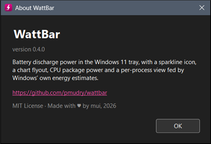

<picture>
  <source media="(prefers-color-scheme: dark)"
          srcset="https://raw.githubusercontent.com/ISC-HEI/isc-logos/main/white/ISC%20Logo%20inline%20white%20v3%20-%20large.webp">
  
</picture>

[](https://dotnet.microsoft.com/)
[](https://www.microsoft.com/windows)

# WattBar

A tiny Windows 11 tray app that shows how fast your laptop battery is draining, in watts. The tray icon carries the live number with a two-minute sparkline behind it; clicking it opens a flyout with a chart of the last 1 to 60 minutes (5 by default), the CPU package power next to the battery figure, the active power scheme and brightness, and an estimate of the time left. Written in C# on [.NET 10](https://dotnet.microsoft.com/) with WinForms and GDI+, and it ships as a single exe.


## Why

CPU load is not battery drain. Task Manager will happily show 2 % CPU while the laptop empties in three hours, because most of what costs energy never shows up as CPU time: the display backlight, a power scheme silently switched to High performance, a process holding the system timer at 1 ms so the CPU package can never go to deep idle, the GPU compositing a large high-refresh screen, Wi-Fi and SSD kept awake by a plan setting. This tool came out of exactly that hunt: an idle drain of 9 to 15 W on a ThinkPad that ended at 2 to 3 W, with none of the culprits visible in the usual places.

So WattBar shows watts, the unit the battery actually cares about, and shows it from two angles that disagree in useful ways. The battery gauge is the truth over minutes: a slow rolling value with the whole machine in it. The CPU package power is instantaneous and reacts within a second, so it tells you whether a change you just made did anything. The gap between the two is the display and the rest of the machine. And because "which process" is the next question, the per-process view surfaces Windows' own energy accounting, the numbers behind Task Manager's Power usage column, ranked so that a heavy process running in the background stands out.


## Preview

| Tray icon (2× zoom) | Flyout | About |
|:---:|:---:|:---:|
|  |  |  |


## Features

- **Watts in the tray** — battery drain, redrawn every second, with a two-minute sparkline of CPU package power behind the digits. On AC with an idle battery it shows the package power instead
- **Chart flyout** — click the icon for the last 1 to 60 minutes of battery and package power, the average and time left, the active power scheme and brightness
- **Who is using it** — per-process energy shares behind Task Manager's "Power usage" column, with heavy background processes highlighted
- **Settings** — theme, language (English, French, German, Italian, following Windows by default), package readout rate, start with Windows, from the gear in the flyout or the tray menu
- **Self-pinning** — promotes itself out of the tray overflow so it stays visible

## Quick Start

```powershell
# Build a single framework-dependent exe into .\dist
.\build.ps1

# Run it (add --show to open the flyout immediately)
.\dist\WattBar.exe
```

Right-click the icon for **Show chart**, **Who is using it…**, **Theme**, **Language**, **Package readout**, **Start with Windows**, **About** and **Exit**. The gear in the flyout opens the same settings.

## How it reads the numbers

**Battery gauge.** The WinRT `Windows.Devices.Power.Battery.AggregateBattery` report exposes the charge rate in milliwatts, signed. WattBar flips the sign so that drain is positive and samples once a second into a two-hour ring buffer. The fuel gauge itself reports a rolling one-minute average and only publishes a new value every 30 to 60 seconds, so this figure is stepped by nature. The same value is what the WMI class `BatteryStatus` in `root\wmi` and the `\Power Meter` performance counter report.

**CPU package power.** The `\Energy Meter(rapl_package0_pkg)\Power` performance counter exposes Intel or AMD RAPL through the Windows EMI interface, unelevated and refreshed every second. It drives the sparkline and the blue series in the chart. Machines whose CPU driver has no EMI support simply do not show it.

**Averages and time left.** For any window that holds at least four minutes of continuous discharge, the average is the drop in remaining capacity divided by the elapsed time. Until then the flyout falls back to the mean of gauge samples and marks it with an asterisk. The time-left estimate uses the same capacity-based average over ten minutes, rounded to ten-minute steps with hysteresis.

**Context.** The active scheme comes from `PowerGetActiveScheme`, the Windows 11 overlay from the `PowerSchemes` registry key, and brightness from the WMI class `WmiMonitorBrightness`. All three are read without elevation every five seconds.

**Per-process estimates.** Task Manager's "Power usage" column comes from the Energy Estimation Engine, which also publishes its per-minute estimates as the ETW provider `Microsoft-Windows-Energy-Estimation-Engine`. Reading it needs an elevated process, so the "Who is using it" window starts a second copy of WattBar as a collector, and explains why. You choose how it may start: with a UAC prompt each time, through a scheduled task registered once with consent and started silently afterwards, or not at all. The collector merges each batch per process and writes `%ProgramData%\WattBar\e3.json`, which the tray app displays; it exits with the tray app or on demand. The unit of those estimates is undocumented, so the window shows shares, plus an approximate CPU wattage obtained by spreading the measured package power over processes by their CPU share. Each row carries the process state for the minute (focus, visible, minimized, background); a background or minimized process above 10 % of CPU share is highlighted in magenta as a likely offender. Screen energy is always charged to the foreground window.

The reasoning behind these choices is in [`docs/ENERGY-FINDINGS.md`](./docs/ENERGY-FINDINGS.md).

## Roadmap

1. **Taskbar embedding** — draw the readout inside the taskbar itself, the way [TrafficMonitor](https://github.com/zhongyang219/TrafficMonitor) does, by parenting a small always-on-top window over `Shell_TrayWnd` next to the system tray. Fragile by nature, so the tray icon stays as the fallback.
2. **CSV log** — optional append-only log of battery, package, brightness and scheme per second for full-day plots.
3. **SRUM history** — a "last 24 h" view of the same per-process estimates from `powercfg /srumutil`.

## Dependencies

WattBar is a single 4 MB exe that needs the .NET 10 desktop runtime; it targets Windows 10 build 19041 or later. The battery gauge comes from WMI rather than the WinRT API so that the 24 MB Windows SDK projection stays out of the bundle, and the ETW library ships without its kernel-trace and symbol helpers, which a real-time user-provider session does not need. Building needs the SDK.

| Tool | Required for | Install |
| --- | --- | --- |
| **.NET 10 SDK** | building | `winget install Microsoft.DotNet.SDK.10`, or the user-local [dotnet-install](https://dot.net/v1/dotnet-install.ps1) script, which `build.ps1` picks up from `%LOCALAPPDATA%\dotnet` |
| **.NET 10 Desktop Runtime** | running | `winget install Microsoft.DotNet.DesktopRuntime.10` |

---

## License

Copyright © 2026 P.-A. Mudry / ISC — HES-SO Valais. Released under the [MIT License](https://opensource.org/licenses/MIT).

---

*Made with ♥ by mui, 2026*
