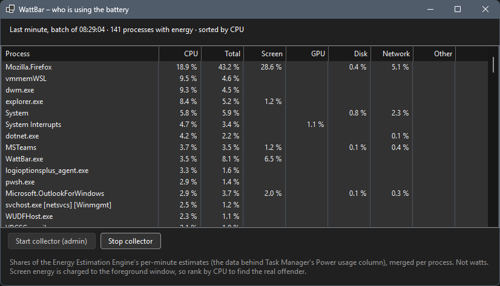

<picture>
  <source media="(prefers-color-scheme: dark)"
          srcset="https://raw.githubusercontent.com/ISC-HEI/isc-logos/main/white/ISC%20Logo%20inline%20white%20v3%20-%20large.webp">
  
</picture>

[](https://dotnet.microsoft.com/)
[](https://www.microsoft.com/windows)

# WattBar

A tiny Windows 11 tray app that shows how fast your laptop battery is draining, in watts. The tray icon carries the live number with a two-minute sparkline behind it; clicking it opens a flyout with a chart of the last 1 to 60 minutes (5 by default), the CPU package power next to the battery figure, the active power scheme and brightness, and an estimate of the time left. Written in C# on [.NET 10](https://dotnet.microsoft.com/) with WinForms and GDI+, and it ships as a single exe.


## Preview

| Tray icon (5× zoom) | Flyout |
|:---:|:---:|
|  |  |



## Features

- **Watts in the tray** — the icon is redrawn every second with the battery gauge reading; below 10 W it keeps one decimal
- **Sparkline in the icon** — the last two minutes of CPU package power, the only instantaneous signal, binned to the icon width
- **Chart flyout** — click the icon for a plot of the last 1, 5, 10, 30 or 60 minutes with the battery gauge and the package power as two series; click the chart to cycle the window
- **Honest averages** — for windows with enough continuous discharge, the average and the time left come from the drop in remaining capacity, not from the mean of gauge samples
- **Context row** — package watts (hover for what that covers), active power scheme and Windows 11 power-mode overlay, panel brightness; the scheme turns magenta when it is not Balanced
- **Theme aware** — digits invert on a light taskbar, flyout follows the app light/dark setting, rounded corners via DWM
- **ISC colours** — magenta while discharging, teal while charging, blue for the package series
- **Who is using it** — an opt-in window ranking processes by their share of Windows' own per-minute energy estimates, fed by a small elevated collector
- **Self-pinning** — promotes itself out of the tray overflow so it stays visible
- **Start with Windows** — toggle from the right-click menu, backed by the per-user Run key

## Quick Start

```powershell
# Build a single framework-dependent exe into .\dist
.\build.ps1

# Run it (add --show to open the flyout immediately)
.\dist\WattBar.exe
```

Right-click the icon for **Show chart**, **Who is using it…**, **Start with Windows** and **Exit**.

## How it reads the numbers

**Battery gauge.** The WinRT `Windows.Devices.Power.Battery.AggregateBattery` report exposes the charge rate in milliwatts, signed. WattBar flips the sign so that drain is positive and samples once a second into a two-hour ring buffer. The fuel gauge itself reports a rolling one-minute average and only publishes a new value every 30 to 60 seconds, so this figure is stepped by nature. The same value is what the WMI class `BatteryStatus` in `root\wmi` and the `\Power Meter` performance counter report.

**CPU package power.** The `\Energy Meter(rapl_package0_pkg)\Power` performance counter exposes Intel or AMD RAPL through the Windows EMI interface, unelevated and refreshed every second. It drives the sparkline and the blue series in the chart. Machines whose CPU driver has no EMI support simply do not show it.

**Averages and time left.** For any window that holds at least four minutes of continuous discharge, the average is the drop in remaining capacity divided by the elapsed time. Until then the flyout falls back to the mean of gauge samples and marks it with an asterisk. The time-left estimate uses the same capacity-based average over ten minutes, rounded to ten-minute steps with hysteresis.

**Context.** The active scheme comes from `PowerGetActiveScheme`, the Windows 11 overlay from the `PowerSchemes` registry key, and brightness from the WMI class `WmiMonitorBrightness`. All three are read without elevation every five seconds.

**Per-process estimates.** Task Manager's "Power usage" column comes from the Energy Estimation Engine, which also publishes its per-minute estimates as the ETW provider `Microsoft-Windows-Energy-Estimation-Engine`. Reading it needs an elevated process, so the "Who is using it" window starts a second copy of WattBar through a UAC prompt. That collector merges each batch per process and writes `%ProgramData%\WattBar\e3.json`, which the tray app displays; it exits with the tray app or on demand. The unit of those estimates is undocumented, so the window shows shares, not watts, and screen energy is always charged to the foreground window.

The reasoning behind these choices is in [`docs/ENERGY-FINDINGS.md`](./docs/ENERGY-FINDINGS.md).

## Roadmap

1. **Taskbar embedding** — draw the readout inside the taskbar itself, the way [TrafficMonitor](https://github.com/zhongyang219/TrafficMonitor) does, by parenting a small always-on-top window over `Shell_TrayWnd` next to the system tray. Fragile by nature, so the tray icon stays as the fallback.
2. **CSV log** — optional append-only log of battery, package, brightness and scheme per second for full-day plots.
3. **SRUM history** — a "last 24 h" view of the same per-process estimates from `powercfg /srumutil`.

## Dependencies

WattBar targets Windows 10 build 19041 or later and needs the .NET 10 desktop runtime. Building needs the SDK.

| Tool | Required for | Install |
| --- | --- | --- |
| **.NET 10 SDK** | building | `winget install Microsoft.DotNet.SDK.10`, or the user-local [dotnet-install](https://dot.net/v1/dotnet-install.ps1) script, which `build.ps1` picks up from `%LOCALAPPDATA%\dotnet` |
| **.NET 10 Desktop Runtime** | running | `winget install Microsoft.DotNet.DesktopRuntime.10` |

---

## License

Copyright © 2026 P.-A. Mudry / ISC — HES-SO Valais. Released under the [MIT License](https://opensource.org/licenses/MIT).

---

*Made with ♥ by mui, 2026*
