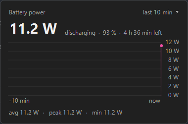

<picture>
  <source media="(prefers-color-scheme: dark)"
          srcset="https://raw.githubusercontent.com/ISC-HEI/isc-logos/main/white/ISC%20Logo%20inline%20white%20v3%20-%20large.webp">
  
</picture>

[](https://dotnet.microsoft.com/)
[](https://www.microsoft.com/windows)

# WattBar

A tiny Windows 11 tray app that shows how fast your laptop battery is draining, in watts. The tray icon carries the live number with a two-minute sparkline behind it; clicking it opens a flyout with a chart of the last 1 to 60 minutes, the average, peak and minimum, and an estimate of the time left. Written in C# on [.NET 10](https://dotnet.microsoft.com/) with WinForms and GDI+, no dependencies, and it ships as a single exe.


## Preview

| Tray icon (5× zoom) | Flyout |
|:---:|:---:|
|  |  |

## Features

- **Watts in the tray** — the icon is redrawn every second with the smoothed discharge rate; below 10 W it keeps one decimal
- **Sparkline in the icon** — the last two minutes of power, binned to the icon width, drawn behind the digits
- **Chart flyout** — click the icon for a plot of the last 1, 10, 30 or 60 minutes; click the chart to cycle the window
- **Time left** — remaining capacity divided by the one-minute average drain
- **Theme aware** — digits invert on a light taskbar, flyout follows the app light/dark setting, rounded corners via DWM
- **ISC colours** — magenta while discharging, the embedded-systems teal while charging
- **Self-pinning** — promotes itself out of the tray overflow so it stays visible
- **Start with Windows** — toggle from the right-click menu, backed by the per-user Run key

## Quick Start

```powershell
# Build a single framework-dependent exe into .\dist
.\build.ps1

# Run it (add --show to open the flyout immediately)
.\dist\WattBar.exe
```

Right-click the icon for **Show chart**, **Start with Windows** and **Exit**.

## How it reads the battery

Power comes from the WinRT `Windows.Devices.Power.Battery.AggregateBattery` report, which exposes the charge rate in milliwatts, signed. WattBar flips the sign so that drain is positive, samples once a second into a two-hour ring buffer, and smooths the tray number with an exponential moving average. The same data is what the WMI class `BatteryStatus` in `root\wmi` reports, so the figures match what you would see from PowerShell.

## Roadmap

1. **Taskbar embedding** — draw the readout inside the taskbar itself, the way [TrafficMonitor](https://github.com/zhongyang219/TrafficMonitor) does, by parenting a small always-on-top window over `Shell_TrayWnd` next to the system tray. Fragile by nature, so the tray icon stays as the fallback.
2. **CSV log** — optional append-only log of samples for full-day plots.
3. **Configurable window and colours** — a small settings dialog instead of constants.

## Dependencies

WattBar targets Windows 10 build 19041 or later and needs the .NET 10 desktop runtime. Building needs the SDK.

| Tool | Required for | Install |
| --- | --- | --- |
| **.NET 10 SDK** | building | `winget install Microsoft.DotNet.SDK.10`, or the user-local [dotnet-install](https://dot.net/v1/dotnet-install.ps1) script, which `build.ps1` picks up from `%LOCALAPPDATA%\dotnet` |
| **.NET 10 Desktop Runtime** | running | `winget install Microsoft.DotNet.DesktopRuntime.10` |

---

## License

Copyright © 2026 P.-A. Mudry / ISC — HES-SO Valais. Released under the [MIT License](https://opensource.org/licenses/MIT).

---

*Made with ♥ by mui, 2026*
